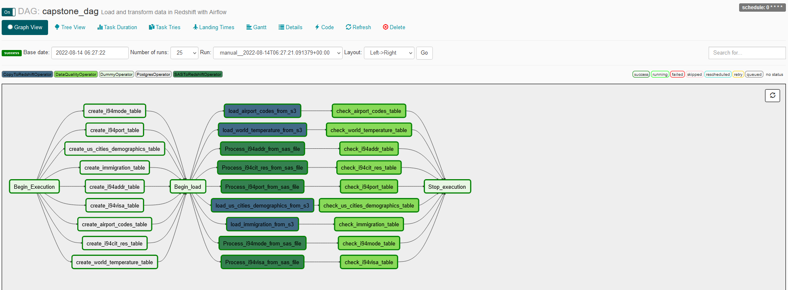

# Data Engineering Capstone

## Scope
The purpose of this project is to develop an ETL pipeline using Airflow, constructing a data warehouse using AWS services such as Redshift and S3 aand defining an efficient data model.

## Datasets
- I94 Immigration Data: This data comes from the US National Tourism and Trade Office found [here](https://travel.trade.gov/research/reports/i94/historical/2016.html).
- World Temperature Data: This dataset came from Kaggle found [here](https://www.kaggle.com/berkeleyearth/climate-change-earth-surface-temperature-data).
- U.S. City Demographic Data: This dataset comes from OpenSoft found [here](https://public.opendatasoft.com/explore/dataset/us-cities-demographics/export/).
- Airport Code Table: This is a simple table of airport codes and corresponding cities. It comes from [here](https://datahub.io/core/airport-codes#data).

Below is an ERD diagram of the immigration fact table and various dimension tables after extracting and creating the tables in Redshift (created using the tool DbSchema).

## ETL Pipeline
Defining the data model and creating the star schema involves various steps. Using Airflow we extract files from S3 buckets, transform the data and then writing CSV and PARQUET files to Redshift as highlighted below in the ETL Dag graph and Tree views. These steps include:
- Parsing data from SAS files on S3 to Redshift tables
- Extracting remaining CSV and PARQUET files from S3
- Writing CSV and PARQUET files from S3 to Redshift
- Performing data quality checks on the newly created tables

## Conclusion
This project covers the following steps involved in developing a data warehouse:
* Creating a Redshift Cluster, IAM Roles, Security groups.
* Developing an ETL Pipeline that copies data from S3 buckets into staging tables to be processed into a star schema on Redshift
* Using Airflow to automate ETL pipelines.
* Custom operators to perform tasks such as creating database objects, staging data, filling the data warehouse, and validation through data quality checks.
* Transforming data from various sources into a star schema.
